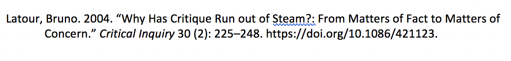

# Zotero and Plaintext Workflows

## Eric Robsky Huntley (@ericmhuntley)

Today, DUSPViz takes a break from the Viz and focuses on citation management using Zotero and writing using plain text (RMarkdown/knitr).

While this may sound a bit dusty (but does it really?) getting your citation and document management down at the front end of your graduate career will save you an enormous, enormous, enormous amount of time later. This may also be useful for doctoral students who are feeling overwhelmed by articles and like they're drowning in Word documents and track changes.

The pitch: imagine a world in which you never have to manually type a works cited page again; imagine a world in which you always know where that one paper you read once is sitting; imagine a world in which your research life can be contained in future-proof plaintext documents that contain your analysis scripts and references to your data as well; imagine a world in which you can use Git instead of (horror of horrors) track changes; that world, my friends, is at our fingertips.

## Install Zotero

Zotero is a free and open-source citation manager that well-supported and every bit as good as the proprietary alternative, Mendeley. If you want more reason to not use Mendeley, note that it's owned by Elsevier. [Elsevier is, by a wide margin, the most exploitative of all the academic publishers;](https://gowers.files.wordpress.com/2012/02/elsevierstatementfinal.pdf) it is notorious for exceedingly high paywalls, absurdly high profit margins, and the production of shelf-filling encyclopedias that serve little purpose other than to extract dollars from university library budgets. If you're considering an academic route, seriously consider boycotting their venues.

But the point, today, is that Zotero is a very good citation manager that plays nicely with word processors and the plaintext workflow we'll be working up to today.

## Import a document

Let's drag and drop a couple of PDFs into Zotero. I've provided two classics:

1. a copy of Bruno Latour's classic 2004 essay, 'Why has critique run out of steam?', published in _Critical Inquiry_ (`./assets/latour_why_2004.pdf`).
2. Nadine Schuurman and Geraldine Pratt's "Care of the Subject: Feminism and Critiques of GIS", published in _Gender, Place, and Culture_ (`./assets/schuurman_care_2002.pdf`).

These are worth reading if you're unfamiliar, but for now let's assume we've all read widely from my (somewhat arcane and idiosyncratic) reading list.

When you drag and drop, Zotero will automatically look for the article in a database. Depending on the metadata present in the PDF, your results may vary. For me, the Schuurman imported correctly, but the Latour did not. Zotero only located the Title, Author, and (incorrect) page number. Let's manually enter some stuff! The full citation is:

+ Latour, Bruno. 2004. “Why Has Critique Run out of Steam?: From Matters of Fact to Matters of Concern.” _Critical Inquiry_ 30 (2): 225–248. `https://doi.org/10.1086/421123`.

Manually cleaning up reference fields is a fairly common task but it's worth keeping on top of. You'll save yourself time and frustration later, I swear.

## Install the word processor add-ons

Now that we've installed Zotero, let's make it talk to our Word processors. Open the preferences pane (`Zotero > Preferences`) and choose the `Cite` tab. As part of an open-source ecosystem, it shouldn't be surprising that Zotero supports Libre/OpenOffice, the open source alternatives to Microsoft Office. But it also support Microsoft Word! Let's install these add-ons.


As a side note: for those of you interested in open sourcing your life, the differences between Open- and LibreOffice are fairly minimal, but there's a history lesson here that [has much to do with the political economy of open source software and Oracle's 2010 acquisition of Sun Microsystems](https://www.pcworld.com/article/2977112/software-productivity/why-you-should-ditch-openoffice-and-use-the-free-libreoffice-suite.html).

## Add a citation

Now let's add a citation in LibreOffice. If you've installed the LibreOffice add-on, you should see the Zotero toolbar, which looks like...


If you don't see this toolbar, make sure the toolbar is viewable (`View > Toolbars > Zotero`). Click the Add Citation button - there might be a slight pause. The document preferences pane should appear, which will allow you to select a citation style - my inner social scientist likes Chicago Author-Date, but live your life.


Next, search for the PDF we just added in the citation interface (once again, Bruno Latour's 'Why has critique run out of steam?').


Voila! Your citation has been added. But of course, when we are citing papers, we're often also citing specific page numbers to attribute quotations. For example, let's quote the opening line of Latour's essay: "Wars. So many wars. Wars inside and wars outside." Let's modify our new citation, by clicking on the citation and choosing the `Add/Edit Citation` Button. Click the citation and indicate that this quotation is drawn from page 225.


### ...and a Bibliography, Too!

Now that we have our very full argument, we can add a bibliography to the end of our document. Click the add/edit bibliography button to add a bibliography to the document and... well, actually... that's it.



Wow! A couple of notes:

1. This can be updated at any time - you don't need to wait until you're done to add your references!
2. We chose Chicago Style Author-Date above, but we can easily change this by modifying the document properties. Zotero will then automatically reformat our entire bibliography.

This is a single citation, so maybe not terribly impressive. However, in a paper with dozens or a thesis with hundreds of citations you can imagine how this is going to save you a ton of time - inserting a bibliography with a single click? Changing the styling of a bibliography with a single click?

## Install ZotFile

Even though Zotero is a very full-featured citation manager, it's still the case that its file management is a bit of a mess. When you add a file---for example, a PDF---by default it is relegated to a nested directory structure of randomly named folders. See below - kinda gross.


This also means that you have to rely on Zotero to manage your files across platforms. While it does have a cloud storage feature, once you start accumulating PDFs, you'll blow over the limits of the free plan pretty quickly; do you really want to add another cloud storage platform to pay for, not to mention manage?

I like to use an add-on called Zotfile to manage my PDFs. [Download it here.](https://www.zotfile.com) Zotfile allows me to store my PDFs on Dropbox, which I can access from any of my devices.

We need to manually point Zotero to the installation file we just downloaded (`zotfile-<version>-fx.xpi`) using the Add-ons Manager (`Tools > Add-ons`). Click the gear on the top right and choose `Install Add-on From File...` and select `zotfile-<version>-fx.xpi`.

Once you've installed, open ZotFile preferences. Under `General Settings`, change the location of files to be a `library` folder in your Dropbox.


Also, specify a `%a_%t_%y` renaming rule (`Renaming Rules`); this will use a predictable convention to rename files (author last name, first word of title, year).


Now let's apply this rule! Right click, `Manage Attachments > Rename attachments` will automatically rename and relocate your PDFs to your specified folder. Nice!

We've now built up a workflow in which we can manage our references, store associated PDFs (and other materials) in a way that carries them across our various devices, and automatically generate and style both citations and bibliographies. But we can go further - we can remove word processors from our workflow entirely and write in pure plain text, harnessing all of the same benefits of citation management.

## Sidebar: Why Plaintext?

One good reason to write in plain text is that your data analysis and writing can all happen in the same place; changes in your analysis or in your data are automatically reflected in your document. You can comment up your work and document your methods, without it appearing in the 'finished text'. All your files are future-proof: decades into the future, long after PDFs and DOCX files have gone the way of the dinosaur, all you'll need to view your work is a piece of software capable of reading text encoded in totally standard ways. You can version control your documents with Git, instead of with (ugh) track changes.

I do all my writing in plain text. You certainly don't have to, and you'll be the exception rather than the norm if you choose to take up the torch. But you'll also have a huge amount of control over your documents and your workflow.

There are a bunch of ways to work with plaintext. We're going to be using `RMarkdown`, an extension of the exceedingly common `markdown` markup langauge (get it?), and `knitr` My personal workflow involves a command line utility called `pandoc`, which I'll happily talk to you about for hours.

## Setting Up Zotero

### Install BetterBibTeX

In order to use citation management in a plaintext file, we'll need a bibliography file that is appropriately formatted. The best tool for maintaining such a bibliography file is a Zotero add-on called [BetterBibTeX](https://github.com/retorquere/zotero-better-bibtex/releases/tag/v5.1.2). Downlaod the most recent version as an `xpi` file and install it just like you installed Zotfile.

### Export a collection

Now, let's create a new collection (`File > New Collection`). Collections are basically playlists for documents (try them at your next party), and are good ways of organizing bibliographies. Drag and drop both articles I've provided into your new collection.

Right click the new collection and choose `Export collection`. Note that you can choose to automatically update the bibliography file! This is a big deal when you're writing as you're researching; add a new source and it's (almost) immediately available for citation.

Open this `.bib` file. You'll see references to your included documents that look like this:

```{latex}
@article{schuurman_care_2002,
  title = {Care of the {{Subject}}: {{Feminism}} and {{Critiques}} of {{GIS}}},
  volume = {9},
  shorttitle = {Care of the {{Subject}}},
  doi = {10.1080/0966369022000003905},
  number = {3},
  journal = {Gender, Place \& Culture},
  author = {Schuurman, Nadine and Pratt, Geraldine},
  pages = {291-299},
  file = {/Users/ehuntley/Zotero/storage/E6XAPDJZ/Schuurman and Pratt - 2002 - Care of the Subject Feminism and Critiques of GIS.pdf}
}
```

Hey! That looks familiar. It starts with a citation key (`schuurman_care_2002`), plus all the fields you'll need for an approrpriate citation, each stored as a variable.

## RMarkdown

Now that we have a bibliography, we can create a new RMarkdown document. Open RStudio. We're going to need a couple of packages to do our work today: `rmarkdown` and `knitr`. Install them in the console.

```{r}
install.packages('rmarkdown')
install.packages('knitr')
```

Now, create a new RMarkdown document (`File > New File > RMarkdown Document`). Give it title, provide your name, and choose html document. It'll automatically populate the document with what's called `yaml` metadata:

```{yaml}
---
title: "Citations! They're Automatic"
author: "Eric Robsky Huntley"
date: "10/24/2018"
output: html_document
---
```

Save this file in a working folder that also contains your bibliography. We need to add a field that adds a link to our bibliography file. Assuming you're following along, this will look a bit like this:


```{yaml}
---
title: "Citations! They're Automatic"
author: "Eric Robsky Huntley"
date: "10/24/2018"
output: html_document
bibliography: "./test_collection.bib"
---
```

Let's add a citation. Remember the citation key in your `.bib` file? This is how you cite the document!

> Bruno Latour has argued that the cynical, conspiratorial sensibilities that have long permeated the critical tradition have limited the remit of our scholarship and prevented us from assembling publics around matters of concern `[@latour_why_2004]`.

Plus a quote:

> `> `"While there may be general agreement about the integral value of critique to scienti!c and intellectual enterprises, less attention has been paid to the form and delivery of critique." `[@schuurman_care_2002, 291]`

That comma syntax is how you specify a page number and the carrot (`>`) specifies that this is a quote. Easy, right? Now that we have a very simple document, we can `knit` it - click the `knit` button at the top of the screen and choose HTML (or Word document).


Holy hell! That's pretty cool.

## For more...

If you're into this, I would highly recommend checking out Kieran Healy's [excellent resources on Plain-Text Social Science](https://kieranhealy.org/files/papers/plain-person-text.pdf); he's written up a long (really, very long) article justifying and explicating his workflow. It's through his resources that I was introduced to the magic of plaintext years ago. [He's also sometimes kind of funny on Twitter](https://twitter.com/kjhealy).

I'd also recommend that you...

1. Install [LaTeX and start playing with templating](https://www.latex-project.org/).
2. Explore [Pandoc as an alternative to Knitr](https://pandoc.org/), for those cases where you might not need R scripting.
